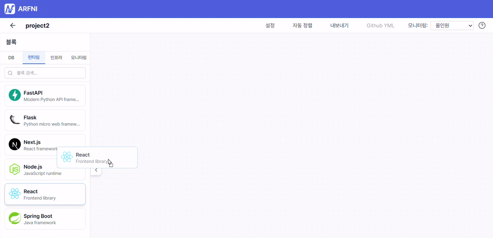
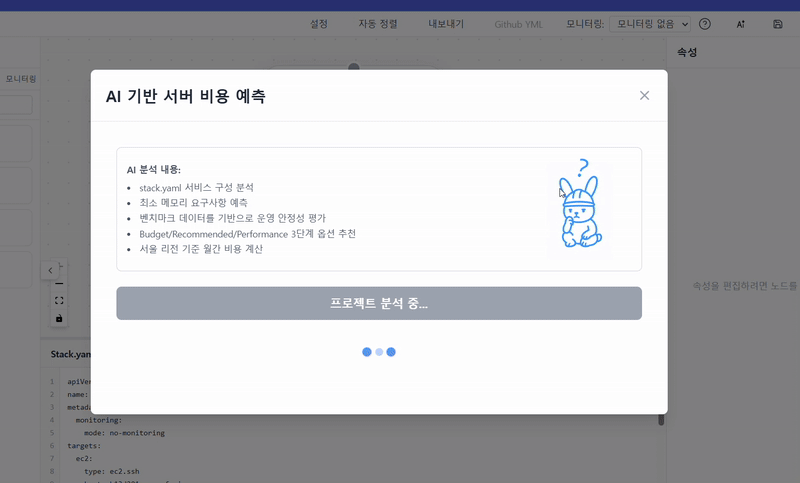
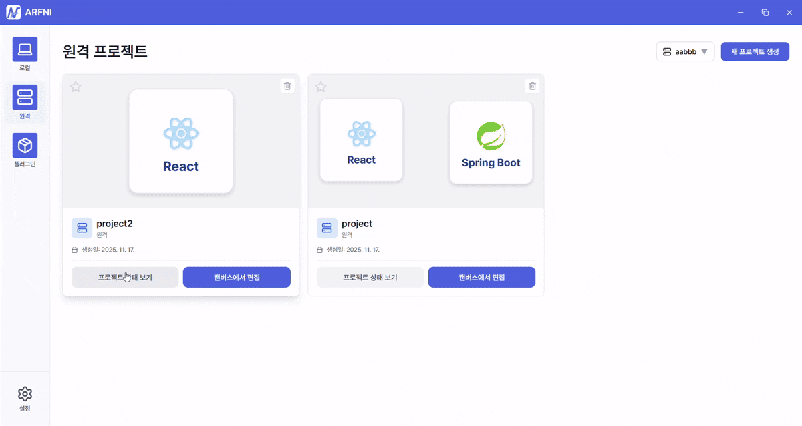

<h1 align="center">
   
  <strong>ARFNI</strong>
</h1>

<h3 align="center">인프라 구축의 개념을 뒤집다</h3>

## 📌 프로젝트 소개
ARFNI는 기존의 어렵고 복잡한 인프라 구축을 GUI 기반으로 쉽고 간편하게 만들어주는 오픈소스 배포 자동화 서비스입니다. 사용할 플러그인을 블록처럼 끌어다 놓고 폼만 채우면, 선언 파일을 자동 생성해 설계→생성→연결→실행→모니터링까지 한 번에 진행할 수 있습니다.

## 🚩 기획 배경
### 1) 클라우드 전환 가속화와 진입 장벽
IT 환경은 물리적 서버에서 클라우드 서버로 빠르게 전환되고 있으며, 클라우드 시장은 매년 급격한 성장세를 보이고 있습니다. 하지만 클라우드 활용의 필수 과정인 '배포(Deployment)'는 여전히 많은 개발자에게 큰 장벽으로 남아 있습니다.

### 2) 개발자가 겪는 실질적인 어려움
실제로 2024년 Stack Overflow 설문조사에 따르면, 약 28,000명의 개발자 중 상당수가 ‘빌드 복잡성(32.9%)’과 ‘배포 복잡성(32.3%)’을 가장 큰 어려움으로 꼽았습니다. 이러한 어려움은 구체적으로 다음과 같은 이유에서 기인합니다.

• **낮은 재현성과 품질 편차:** 복잡한 환경 파일과 네트워크 설정을 수동으로 맞추다 보니, 작업자마다 결과물이 달라지거나 인적 오류(Human Error)가 발생하기 쉽습니다.

• **환경 전환의 비효율성:** 로컬(Local) /서버(Server) / 클라우드(Cloud)로 환경을 전환할 때마다 반복적인 설정 작업이 요구되어 개발 생산성을 크게 저하시킵니다.

### ✨ ARFNI의 해결 솔루션
우리는 이러한 비효율을 해결하기 위해 GUI 기반의 인프라 구축 및 배포 자동화 서비스, ARFNI를 기획했습니다.

ARFNI는 복잡한 터미널 명령어 대신 직관적인 블록(Block) 형태의 GUI를 제공하여 인프라를 설계하면, 시스템이 자동으로 명세서(Stack.yaml)를 생성하고 배포까지 원클릭으로 수행합니다. 이를 통해 인프라 구축의 진입 장벽을 낮추고, 개발자가 인프라 관리보다는 핵심 비즈니스 로직 개발에 집중할 수 있는 환경을 제공합니다.

## 🪄  주요 기능

### **1) 직관적인 드래그&드롭 인프라 설계**

React Flow 기반의 GUI에서 웹, 백엔드, 프록시, 캐시, 메시지 브로커 등의 서비스를 블록 형태로 끌어다 놓으며 직관적으로 인프라를 설계할 수 있습니다.

- 노드 추가 및 연결을 통한 서비스 간 종속성 시각화
- 우측 속성 패널에서 포트, 볼륨, 환경변수, 시크릿 등 세부 설정 입력
- 실시간 동기화로 즉시 배포 가능한 구성 생성

### **2) stack.yaml 선언 파일 자동 생성**

캔버스에서 구성한 인프라를 표준화된 선언형 파일(`stack.yaml`)로 자동 변환합니다.

- 각 노드의 설정을 YAML 구조로 자동 변환
- CLI에서 바로 실행 가능한 표준 포맷

### **3) Go 기반 CLI 엔진으로 자동 배포**

Arfni의 핵심 엔진이 `stack.yaml`을 해석해 Docker 및 EC2 환경에 자동으로 배포합니다.

- **로컬 환경**: Docker Compose 기반 즉시 실행
- **원격 환경**: SSH를 통한 EC2 자동 배포 (Docker 설치를 포함)
- 대상 환경에 맞는 Compose 파일 자동 생성 및 `build`, `up` 명령 실행
- EC2의 경우 SCP를 통한 산출물 업로드 후 원격 실행

### **4) AI 기반 EC2 인스턴스 추천 및 비용 산정**

OpenAI API를 활용하여 프로젝트에 최적화된 EC2 인스턴스를 추천하고 예상 비용을 산정합니다.

- 워크로드 분석 기반 인스턴스 타입 추천
- 예상 월간 운영 비용 자동 계산
- 비용 효율적인 인프라 구성 가이드 제공

### 5) 통합 모니터링·컨테이너 제어를 제공하는 GUI 서버 관리 기능

- Grafana/Prometheus 대시보드를 GUI 내부에 임베딩하여 실시간 서버 상태를 직접 확인
- 기본 대시보드 템플릿을 사전에 설정해 즉시 모니터링 가능하도록 구성
- Docker 컨테이너 목록을 GUI 형식으로 제공하고, 중지·재시작·삭제 기능을 버튼으로 제어하도록 구현
- 서버 상태 확인과 운영이 직관적으로 이루어지는 간단·효율적인 관리자 화면 제공
    
    
    
    
    

### 6) Framework 기반 자동화 CI/CD 구축

- 프레임워크 템플릿 기반으로 표준 CI/CD 구성 자동 생성
- GitHub Access Token을 이용해 프로젝트를 자동 클론
- Arfni가 워크플로우 파일을 자동 생성하여 프로젝트에 Push

- CI/CD에 필요한 변수(Secrets, 환경값 등)를 GUI에서 설정하면 바로 적용
- 개발자가 별도로 파일 작성 없이 **즉시 GitHub Actions 파이프라인을 사용할 수 있도록 자동 구성**

---

### 오픈소스 기능

### 7) Template plugins

`stack.yaml` 파일은 사용자가 캔버스에서 설계한 아키텍처를 기반으로 생성되는 **인프라 명세서**입니다.

현재 제공되는 기본 프레임워크(React, Spring Boot 등) 외에도,

**새로운 프레임워크를 추가하고 싶다면 “템플릿 플러그인”을 제작하여 확장할 수 있습니다.**

템플릿 플러그인은

- `stack.yaml` 구조를 템플릿화하여
- 새로운 프레임워크의 Dockerfile·Compose 설정·빌드 경로 등을 정의하고
- Arfni가 이를 자동으로 적용해 배포할 수 있도록 만들어줍니다.

즉, **사용자나 외부 개발자가 원하는 어떤 프레임워크든 추가 가능한 확장 기능**입니다.

자세한 제작 방식은 아래 가이드를 참고하세요.

<a href="https://github.com/Arfni/arfni-plugins/"> 💻플러그인 제작 가이드</a> 

### 8) exe plugins

외부 실행 파일 과 JSON 기반으로 통신하도록 설계된 확장 기능입니다.

Arfni는 JSON 데이터를 외부 exe 파일에 전달하고,

해당 프로그램이 출력하는 Standard Output(STDOUT) 을 받아 기능을 수행합니다.

즉, 정해진 JSON 규격만 지키면

- 어떤 언어(Python, Go, C, Java 등)로 만든 exe 파일이든 연결할 수 있고
- React 페이지 + exe 실행 파일만으로
    
    새로운 기능을 쉽게 추가할 수 있는 구조입니다.
    

## 🎢 아키텍처

